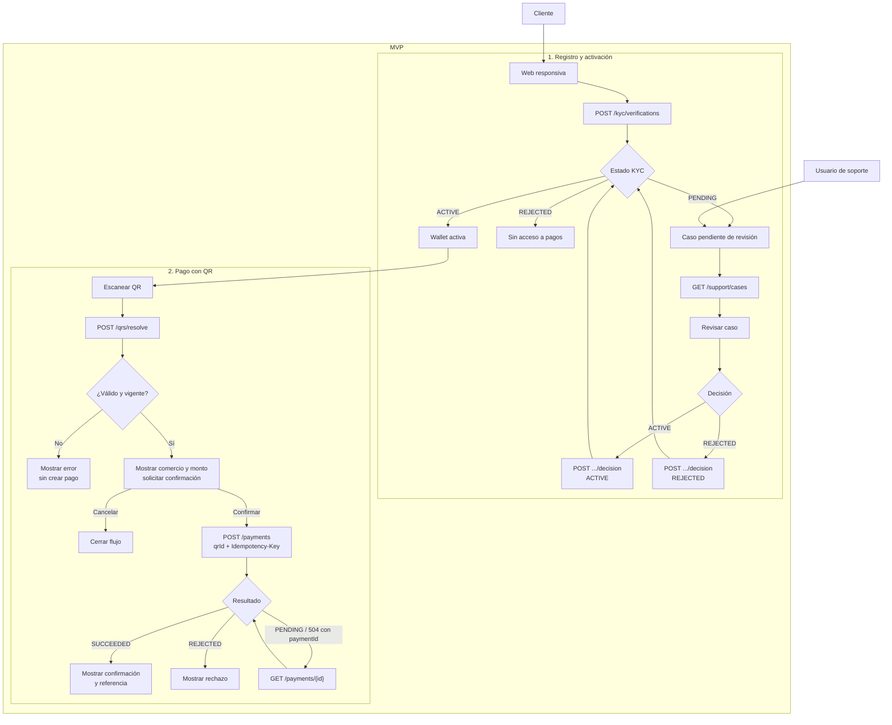

# Onboarding y pago con QR

```mermaid
flowchart TB
    C["Cliente"]
    WEB["Web responsiva"]
    SUPPORT["Usuario de soporte"]

    C --> WEB

    subgraph MVP["MVP"]
        direction TB

        subgraph ONBOARD["1. Registro y activación"]
            WEB --> KYC["POST /kyc/verifications"]
            KYC --> KS{"Estado KYC"}
            KS -->|"ACTIVE"| WALLET["Wallet activa"]
            KS -->|"PENDING"| CASE["Caso pendiente de revisión"]
            KS -->|"REJECTED"| BLOCK["Sin acceso a pagos"]
            CASE --> CASES["GET /support/cases"]
            CASES --> REVIEW["Revisar caso"]
            REVIEW --> DEC{"Decisión"}
            DEC -->|"ACTIVE"| APPROVE["POST .../decision<br/>ACTIVE"]
            DEC -->|"REJECTED"| DENY["POST .../decision<br/>REJECTED"]
            APPROVE --> KS
            DENY --> KS
        end

        subgraph QRPAY["2. Pago con QR"]
            WALLET --> SCAN["Escanear QR"]
            SCAN --> RESOLVE["POST /qrs/resolve"]
            RESOLVE --> VALID{"¿Válido y vigente?"}
            VALID -->|"No"| QRERROR["Mostrar error<br/>sin crear pago"]
            VALID -->|"Sí"| CONFIRM["Mostrar comercio y monto<br/>solicitar confirmación"]
            CONFIRM -->|"Cancelar"| CANCEL["Cerrar flujo"]
            CONFIRM -->|"Confirmar"| PAY["POST /payments<br/>qrId + Idempotency-Key"]
            PAY --> RESULT{"Resultado"}
            RESULT -->|"SUCCEEDED"| SUCCESS["Mostrar confirmación<br/>y referencia"]
            RESULT -->|"REJECTED"| REJECT["Mostrar rechazo"]
            RESULT -->|"PENDING / 504 con paymentId"| CHECK["GET /payments/{id}"]
            CHECK --> RESULT
        end

        ONBOARD ~~~ QRPAY
    end

    SUPPORT --> CASE
```